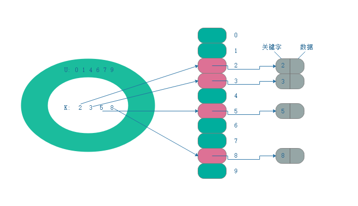

散列表
------

> 散列表（hash table）是实现字典操作的一种有效数据结构。

* 当实际存储的关键字数目比全部的可能关键字总数要小时，可以采用散列表。
* 在散列表中，不是直接把关键字作为数组的下标，而是根据关键字计算出相应的下标。
* 冲突（collision），指多个关键字映射到数组的同一个下标。

**直接寻址表**
> 直接寻址表（direct-address table）不属于散列表。

当关键字的全域U比较小时，直接寻址是一种简单而有效的技术。直接寻址表一般使用一个数组来表示动态集合（假设没有两个元素具有相同的键值），其中数组下标为对应的key值，其插入、查询、删除的时间复杂度可以达到O(1)。



```java
public class DirectAddressTable<V> {

    private Object[] datas;

    public DirectAddressTable(int size) {
        datas = new Object[size];
    }

    // 插入
    public void insert(int key, V value) {
        datas[key] = value;
    }

    // 查询
    public Object search(int key) {
        return datas[key];
    }

    // 删除
    public void delete(int key) {
        datas[key] = null;
    }

}
```


